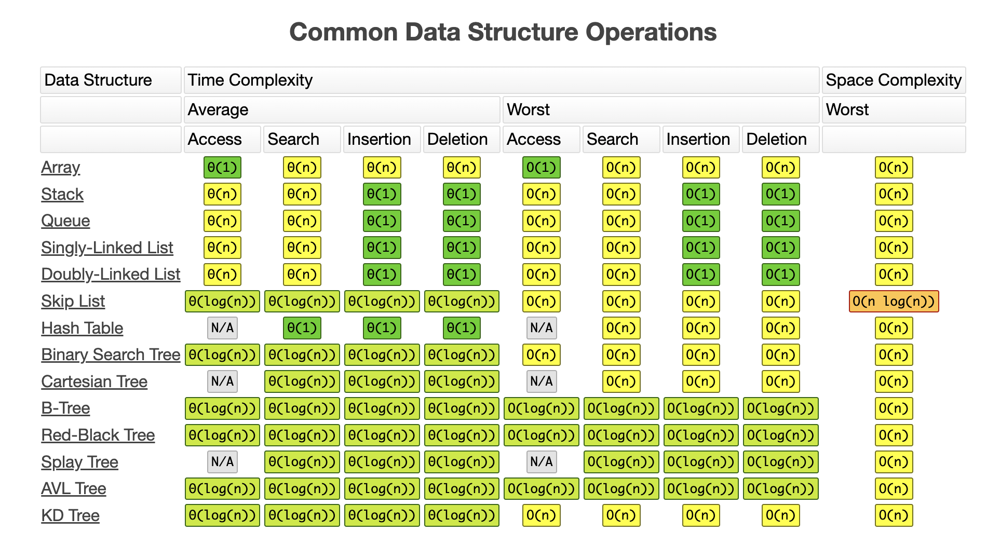

# Data Structure

This repo propose is teach and help with doubts around data structures like:

- Linked List
- Doubly Linked List
- Stacks
- Queues
- Trees
- Hash Tables
- Graphs
- Heaps

And sorts like:

- Bubble
- Merge
- Quick

Each code can be found in its own class.

## Big O Notation

The following image contains all these data structures with their big o time operations:

